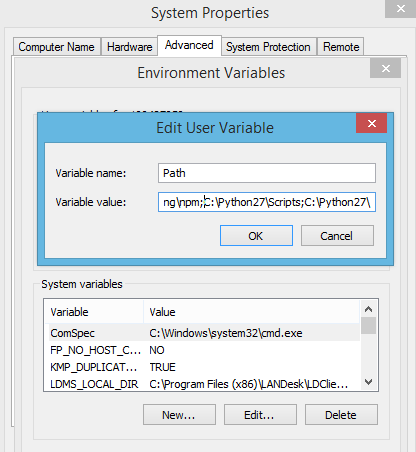
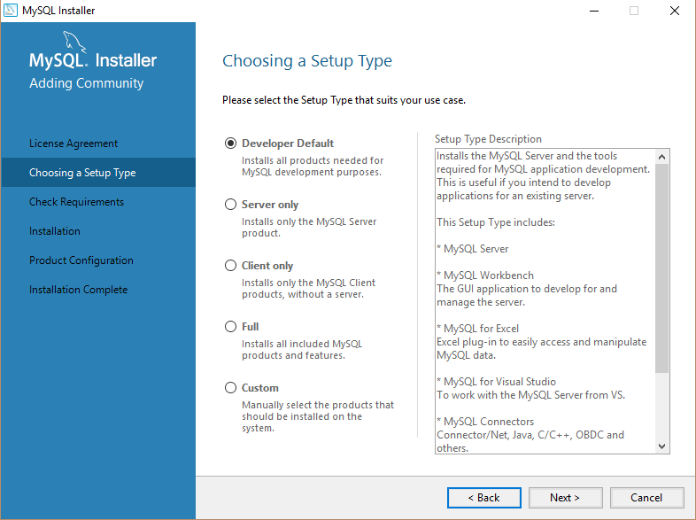
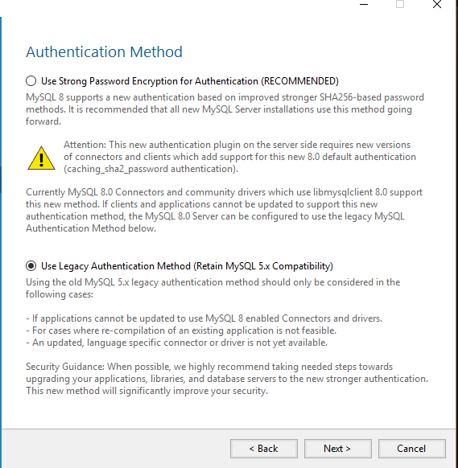

# data-management-lab-7 FALL 2020
Cloned from original repositery [link](https://github.com/sealneaward/data-management-lab-7)
Repository to hold setup instructions for lab 7.

# Setup
- [Windows](#windows-setup)
- [Linux](#linux-setup)
- [MySQL Database Setup](#mysql-database-setup)
- [MySQL Schema Setup](#mysql-schema-setup)
- [Pycharm Setup](#pycharm-ide-setup)
- [Running Project](#run-project)
- [Additional Styling](#styling)
- [Tasks to Complete For Lab](#api)

# Windows Setup
- Install git [if not already installed](https://git-scm.com/download/win)
- Clone project *run in cmd as admin*
```
git clone https://github.com/sealneaward/data-management-lab-7
```
- Install [Python 2.7 (Recommended)](https://www.python.org/downloads/release/python-2718/)
- Add Python and Python scripts to path variable, **no spaces**
- Follow this [link](https://datascience.com.co/how-to-install-python-2-7-and-3-6-in-windows-10-add-python-path-281e7eae62a) for more details about installing python 2.7.



- Install dependencies *run in cmd as admin in project folder*
```
pip install -r requirements-2.7.txt
pip install wheel
pip install MySQL_python-1.2.5-cp27-none-win_amd64.whl
pip install mysqlclient-1.3.13-cp27-cp27m-win_amd64.whl
python setup.py build
python setup.py install
```

- Install [MySQL Server](https://dev.mysql.com/downloads/mysql/) (Skip if alrady installed)


# Linux Setup
- Install git if not already installed
```
sudo apt-get install git
```
- setup virtual environment in project folder [more documentation](http://docs.python-guide.org/en/latest/dev/virtualenvs/)
```
sudo apt install python-pip python-dev build-essential libpq-dev
sudo apt-get install mysql-server mysql-workbench libmysqlclient-dev
pip install -r requirements-2.7.txt
python setup.py build
python setup.py install
```

# If MySQL Server and Database are already installed before from previous lab, skip to [MySQL Schema Setup](#mysql-schema-setup).
# Just make sure that you have the follwing user details
| Username           | Password  |
| ------------- | ----- |
| root | root |

# MySQL Database Setup
- Install [MySQL](http://dev.mysql.com/downloads/installer/)
- When installing, make sure to include the MySQL Workbench in the installation
- Select the default developer installation





- The installation should allow you the option to create a user. Enter in the following info.

| Username           | Password  |
| ------------- | ----- |
| root | root |


# MySQL Schema Setup
- When creating a database, make sure to create a database with the following info
- Click on new schema button (disk with plus sign at top toolbar)

| Schema       |
| ------------- |
| nba    |


- Use the .sql scripts in the db/schema folder to create the tables. Run as queries.


### Additional MySQL Setup

```py
sqlalchemy.exc.OperationalError: (_mysql_exceptions.OperationalError) (2059, "Authentication plugin 'caching_sha2_password' cannot be loaded: The specified module could not be found.\r\n")
```
**Fix:** *Run the SQL query shown into MySQL.*
```sql
ALTER USER '[YOURUSERNAME]'@'localhost' IDENTIFIED WITH mysql_native_password BY '[YOURPASSWORD]';
```

# PyCharm IDE Setup
- download and install [PyCharm](https://www.jetbrains.com/pycharm/)
- you can get a free license from JetBrains if you are a [student](https://www.jetbrains.com/student/)


### PyCharm Debugging
- click on the dropdown arrow  and select edit configurations
- add a python configuration with the following settings

**For Web Server**


**For Databse Population**


### Run Project
1. Run the `populate.py` script.

2. Run the `web.py` script.


**Note:** You can run the web and populate scripts on the command line if you ran the package installation on db.

# API
While the web.py script is running and the web page is visible, investigate the web.py script to see if you can invoke the API to get a player's information through a JSON response. **Hint:** *look at the api route and what an example player id would be.*
