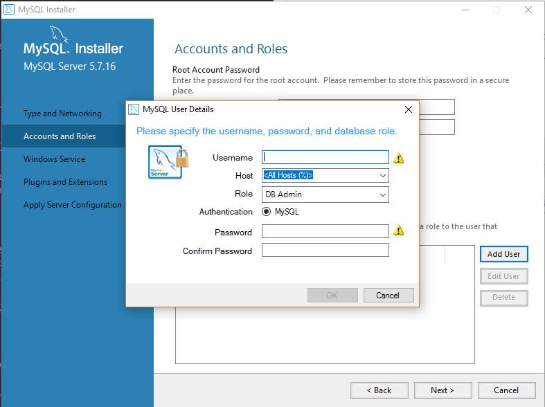
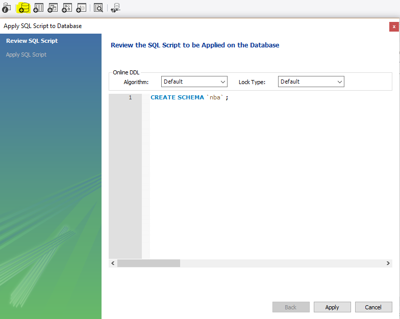

# data-management-lab-7
Repository to hold setup instructions for lab 7.

# Setup
- [Windows](#windows-setup)
- [Linux](#linux-setup)
- [MySQL Database Setup](#mysql-database-setup)
- [MySQL Schema Setup](#mysql-schema-setup)
- [Pycharm Setup](#pycharm-ide-setup)
- [Running Project](#run-project)
- [Additional Styling](#styling)
- [Tasks to Complete For Lab](#complete)

# Windows Setup
- Install git [if not already installed](https://git-scm.com/download/win)
- Clone project *run in cmd as admin*
```
git clone https://github.com/sealneaward/data-management-lab-7
```
- Install [Python 2.7](https://www.python.org/downloads/release/python-2712/)
- Add Python and Python scripts to path variable, **no spaces**


- Install dependencies *run in cmd as admin in project folder*
```
pip install -r requirements.txt
python setup.py build
python setup.py install
```
- Install [MySQL Server](https://dev.mysql.com/downloads/mysql/)


# Linux Setup
- Install git if not already installed
```
sudo apt-get install git
```
- setup virtual environment in project folder [more documentation](http://docs.python-guide.org/en/latest/dev/virtualenvs/)
```
sudo apt install python-pip python-dev build-essential libpq-dev
sudo apt-get install mysql-server mysql-workbench libmysqlclient-dev
pip install -r requirements.txt
python setup.py build
python setup.py install
```


# MySQL Database Setup
- Install [MySQL](http://dev.mysql.com/downloads/installer/)
- When installing, make sure to include the MySQL Workbench in the installation
- Select the default developer installation


- The installation should allow you the option to create a user. Enter in the following info.

| Username           | Password  |
| ------------- | ----- |
| root | root |




# MySQL Schema Setup
- When creating a database, make sure to create a database with the following info
- Click on new schema button (disk with plus sign at top toolbar)

| Schema       |
| ------------- |
| nba    |



- Use the .sql scripts in the db/schema folder to create the tables. Run as queries.


# PyCharm IDE Setup
- download and install [PyCharm](https://www.jetbrains.com/pycharm/)
- you can get a free license from JetBrains if you are a [student](https://www.jetbrains.com/student/)


### PyCharm Debugging
- click on the dropdown arrow  and select edit configurations
- add a python configuration with the following settings

**For Web Server**


**For Databse Population**


# Run Project
- use configurations created in PyCharm for `web.py` and `populate.py`
- to run, click the green arrow button besides the dropdown used for configuration


- to debug, click on the green sun icon


**Note:** You can run the web and populate scripts on the command line if you ran the package installation on db.

# Styling
- I used Materialize.css for this project
